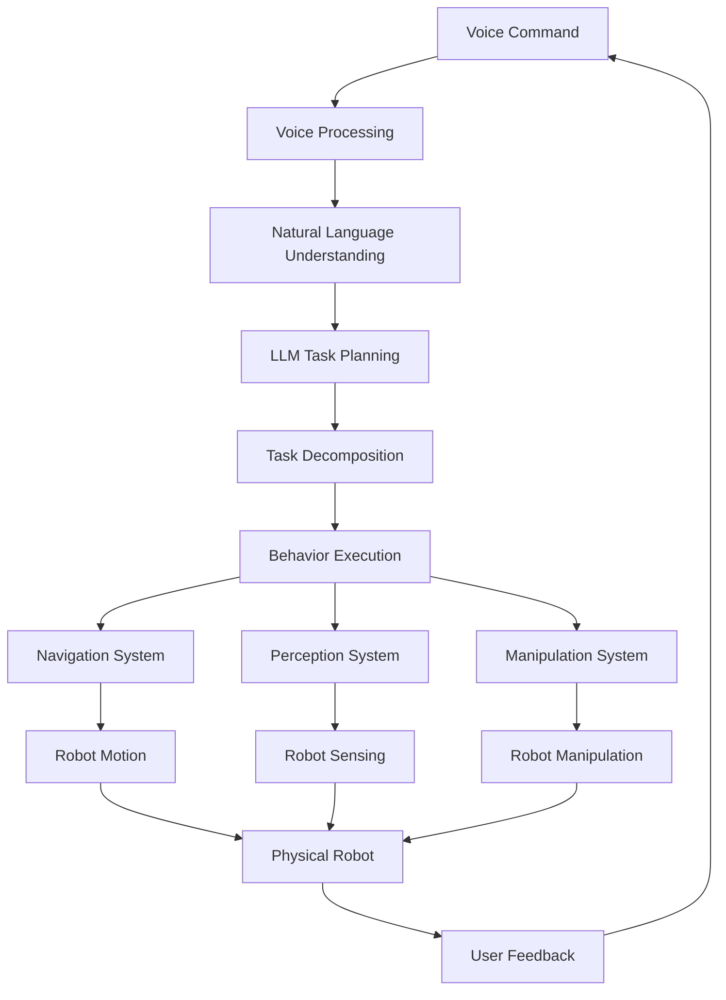

# System Integration

## Overview

This section covers the integration of all subsystems into a complete autonomous humanoid system. System integration is the process of combining individual components into a cohesive, functional whole that can execute complex tasks from voice command to physical action.

## Integration Architecture

### High-Level Integration

The integrated system architecture connects all major subsystems:



### Integration Points

Key integration points in the system:
- **Voice to Planning**: Connecting speech recognition with task planning
- **Planning to Execution**: Translating high-level plans to executable actions
- **Perception to Action**: Using sensory input to guide behavior
- **Multiple Systems Coordination**: Managing concurrent subsystems

## Integration Framework

### Message-Based Integration

Use ROS 2 messages for subsystem communication:

```python
# Standard message types for integration
class IntegrationMessages:
    # Voice processing outputs
    VOICE_COMMAND = "voice_command"
    PARSED_INTENT = "parsed_intent"

    # Planning system outputs
    TASK_PLAN = "task_plan"
    DECOMPOSED_TASKS = "decomposed_tasks"

    # Execution system outputs
    EXECUTION_STATUS = "execution_status"
    BEHAVIOR_FEEDBACK = "behavior_feedback"

    # Perception system outputs
    OBJECT_DETECTION = "object_detection"
    SCENE_UNDERSTANDING = "scene_understanding"

    # Navigation system outputs
    NAVIGATION_GOAL = "navigation_goal"
    NAVIGATION_STATUS = "navigation_status"

    # Manipulation system outputs
    MANIPULATION_COMMAND = "manipulation_command"
    MANIPULATION_STATUS = "manipulation_status"
```

### Integration Manager

Create an integration manager to coordinate subsystems:

```python
import rclpy
from rclpy.node import Node
from std_msgs.msg import String
from geometry_msgs.msg import PoseStamped
from sensor_msgs.msg import Image, LaserScan
import json
import threading
from typing import Dict, Any, Optional

class IntegrationManager(Node):
    def __init__(self):
        super().__init__('integration_manager')

        # Publishers for each subsystem
        self.voice_command_publisher = self.create_publisher(
            String, 'voice_command', 10)
        self.task_plan_publisher = self.create_publisher(
            String, 'task_plan', 10)
        self.behavior_command_publisher = self.create_publisher(
            String, 'behavior_command', 10)
        self.navigation_goal_publisher = self.create_publisher(
            PoseStamped, 'goal_pose', 10)
        self.manipulation_command_publisher = self.create_publisher(
            String, 'manipulation_command', 10)

        # Subscribers for system feedback
        self.voice_result_subscriber = self.create_subscription(
            String, 'voice_processing_result', self.voice_result_callback, 10)
        self.planning_result_subscriber = self.create_subscription(
            String, 'planning_result', self.planning_result_callback, 10)
        self.execution_status_subscriber = self.create_subscription(
            String, 'execution_status', self.execution_status_callback, 10)
        self.perception_result_subscriber = self.create_subscription(
            String, 'perception_result', self.perception_result_callback, 10)

        # System state tracking
        self.system_state = {
            'voice_processing': 'idle',
            'planning': 'idle',
            'execution': 'idle',
            'navigation': 'idle',
            'manipulation': 'idle',
            'perception': 'idle'
        }

        # Active tasks tracking
        self.active_tasks = {}
        self.task_queue = []
        self.current_task = None

        # Integration timers
        self.integration_timer = self.create_timer(0.1, self.integration_callback)

        self.get_logger().info('Integration Manager initialized')

    def process_voice_command(self, command_text: str):
        """Process a voice command through the integrated system"""
        self.get_logger().info(f'Received voice command: {command_text}')

        # Publish to voice processing subsystem
        voice_msg = String()
        voice_msg.data = json.dumps({
            'command': command_text,
            'timestamp': self.get_clock().now().to_msg().sec
        })
        self.voice_command_publisher.publish(voice_msg)

        # Update system state
        self.system_state['voice_processing'] = 'processing'

    def voice_result_callback(self, msg):
        """Handle voice processing results"""
        try:
            result_data = json.loads(msg.data)
            intent = result_data.get('intent')
            entities = result_data.get('entities')

            self.get_logger().info(f'Voice processing result: {intent}')

            # Pass to planning system
            if intent and entities:
                self.send_to_planning_system(intent, entities)

        except json.JSONDecodeError:
            self.get_logger().error('Invalid JSON in voice result')

    def send_to_planning_system(self, intent: Dict[str, Any], entities: Dict[str, Any]):
        """Send processed voice command to planning system"""
        plan_request = {
            'intent': intent,
            'entities': entities,
            'context': self.get_current_context()
        }

        plan_msg = String()
        plan_msg.data = json.dumps(plan_request)
        self.task_plan_publisher.publish(plan_msg)

        self.system_state['planning'] = 'active'

    def planning_result_callback(self, msg):
        """Handle planning system results"""
        try:
            plan_data = json.loads(msg.data)
            task_plan = plan_data.get('task_plan')

            self.get_logger().info(f'Planning result received: {len(task_plan)} steps')

            # Decompose and schedule tasks
            self.schedule_task_execution(task_plan)

        except json.JSONDecodeError:
            self.get_logger().error('Invalid JSON in planning result')

    def schedule_task_execution(self, task_plan: list):
        """Schedule task execution based on the plan"""
        self.task_queue = task_plan
        self.system_state['execution'] = 'active'

        # Execute first task if none is active
        if not self.current_task and self.task_queue:
            self.execute_next_task()

    def execute_next_task(self):
        """Execute the next task in the queue"""
        if not self.task_queue:
            self.system_state['execution'] = 'completed'
            return

        self.current_task = self.task_queue.pop(0)
        task_type = self.current_task.get('type', 'unknown')

        self.get_logger().info(f'Executing task: {task_type}')

        if task_type == 'navigation':
            self.execute_navigation_task(self.current_task)
        elif task_type == 'manipulation':
            self.execute_manipulation_task(self.current_task)
        elif task_type == 'perception':
            self.execute_perception_task(self.current_task)
        else:
            self.execute_generic_task(self.current_task)

    def execute_navigation_task(self, task: Dict[str, Any]):
        """Execute navigation task"""
        goal_pose = task.get('parameters', {}).get('goal_pose', {})

        pose_msg = PoseStamped()
        pose_msg.header.stamp = self.get_clock().now().to_msg()
        pose_msg.header.frame_id = 'map'
        pose_msg.pose.position.x = goal_pose.get('x', 0.0)
        pose_msg.pose.position.y = goal_pose.get('y', 0.0)
        pose_msg.pose.position.z = goal_pose.get('z', 0.0)
        pose_msg.pose.orientation.w = 1.0  # Default orientation

        self.navigation_goal_publisher.publish(pose_msg)
        self.system_state['navigation'] = 'active'

    def execute_manipulation_task(self, task: Dict[str, Any]):
        """Execute manipulation task"""
        command = task.get('parameters', {}).get('command', 'unknown')

        cmd_msg = String()
        cmd_msg.data = json.dumps({
            'command': command,
            'parameters': task.get('parameters', {})
        })
        self.manipulation_command_publisher.publish(cmd_msg)
        self.system_state['manipulation'] = 'active'

    def execution_status_callback(self, msg):
        """Handle execution status updates"""
        try:
            status_data = json.loads(msg.data)
            task_id = status_data.get('task_id')
            status = status_data.get('status')

            self.get_logger().info(f'Task {task_id} status: {status}')

            if status == 'completed':
                # Move to next task
                self.current_task = None
                self.execute_next_task()
            elif status == 'failed':
                # Handle failure
                self.handle_task_failure(task_id, status_data)

        except json.JSONDecodeError:
            self.get_logger().error('Invalid JSON in execution status')

    def integration_callback(self):
        """Main integration callback for system coordination"""
        # Monitor system health
        self.monitor_system_health()

        # Check for timeout conditions
        self.check_task_timeouts()

        # Publish system status
        self.publish_system_status()

    def monitor_system_health(self):
        """Monitor the health of all subsystems"""
        # Check if any subsystems are stuck or failed
        for subsystem, status in self.system_state.items():
            if status == 'error':
                self.get_logger().error(f'Subsystem {subsystem} in error state')
                self.handle_subsystem_error(subsystem)

    def get_current_context(self) -> Dict[str, Any]:
        """Get current system context for planning"""
        return {
            'robot_position': self.get_robot_position(),
            'environment_map': self.get_environment_map(),
            'known_objects': self.get_known_objects(),
            'recent_interactions': self.get_recent_interactions()
        }

    def publish_system_status(self):
        """Publish overall system status"""
        status_msg = String()
        status_msg.data = json.dumps({
            'system_state': self.system_state,
            'active_tasks': len(self.task_queue),
            'current_task': self.current_task['id'] if self.current_task else None,
            'timestamp': self.get_clock().now().to_msg().sec
        })

        # Publish to system status topic
        status_publisher = self.create_publisher(String, 'system_status', 10)
        status_publisher.publish(status_msg)
```

## Subsystem Coordination

### Synchronization Mechanisms

Implement synchronization between subsystems:

```python
import threading
import time
from collections import defaultdict

class SubsystemSynchronizer:
    def __init__(self):
        self.sync_conditions = defaultdict(threading.Condition)
        self.subsystem_data = defaultdict(lambda: {'data': None, 'ready': False})
        self.timeout = 10.0  # seconds

    def wait_for_subsystem(self, subsystem: str, timeout: float = None) -> Optional[Dict[str, Any]]:
        """Wait for a subsystem to be ready"""
        timeout = timeout or self.timeout

        with self.sync_conditions[subsystem]:
            start_time = time.time()
            while not self.subsystem_data[subsystem]['ready']:
                remaining_time = timeout - (time.time() - start_time)
                if remaining_time <= 0:
                    return None
                self.sync_conditions[subsystem].wait(timeout=remaining_time)

            return self.subsystem_data[subsystem]['data']

    def signal_subsystem_ready(self, subsystem: str, data: Dict[str, Any]):
        """Signal that a subsystem is ready with data"""
        with self.sync_conditions[subsystem]:
            self.subsystem_data[subsystem]['data'] = data
            self.subsystem_data[subsystem]['ready'] = True
            self.sync_conditions[subsystem].notify_all()

    def reset_subsystem(self, subsystem: str):
        """Reset subsystem readiness"""
        with self.sync_conditions[subsystem]:
            self.subsystem_data[subsystem]['ready'] = False
            self.subsystem_data[subsystem]['data'] = None
```

### Data Flow Management

Manage data flow between subsystems:

```python
class DataFlowManager:
    def __init__(self):
        self.data_buffers = defaultdict(list)
        self.data_subscribers = defaultdict(list)
        self.data_publishers = {}

    def publish_data(self, topic: str, data: Any):
        """Publish data to a topic"""
        self.data_buffers[topic].append(data)

        # Notify subscribers
        for callback in self.data_subscribers[topic]:
            try:
                callback(data)
            except Exception as e:
                print(f"Error in subscriber callback: {e}")

    def subscribe_to_topic(self, topic: str, callback):
        """Subscribe to a topic"""
        self.data_subscribers[topic].append(callback)

    def get_latest_data(self, topic: str) -> Any:
        """Get the latest data from a topic"""
        if self.data_buffers[topic]:
            return self.data_buffers[topic][-1]
        return None

    def get_data_history(self, topic: str, count: int = 10) -> list:
        """Get recent data from a topic"""
        return self.data_buffers[topic][-count:]
```

## Error Handling and Recovery

### Integration Error Handling

Handle errors across the integrated system:

```python
class IntegrationErrorHandler:
    def __init__(self):
        self.error_handlers = {
            'timeout': self.handle_timeout_error,
            'communication': self.handle_communication_error,
            'execution': self.handle_execution_error,
            'safety': self.handle_safety_error
        }
        self.recovery_strategies = {}
        self.error_history = []

    def handle_integration_error(self, error_type: str, error_data: Dict[str, Any]):
        """Handle integration errors"""
        if error_type in self.error_handlers:
            return self.error_handlers[error_type](error_data)
        else:
            return self.handle_generic_error(error_type, error_data)

    def handle_timeout_error(self, error_data: Dict[str, Any]) -> bool:
        """Handle timeout errors"""
        subsystem = error_data.get('subsystem', 'unknown')
        self.get_logger().warn(f'Timeout in subsystem: {subsystem}')

        # Attempt recovery
        return self.attempt_recovery(subsystem, 'timeout')

    def handle_communication_error(self, error_data: Dict[str, Any]) -> bool:
        """Handle communication errors between subsystems"""
        source = error_data.get('source', 'unknown')
        target = error_data.get('target', 'unknown')
        self.get_logger().error(f'Communication error from {source} to {target}')

        # Check if we can re-establish communication
        return self.attempt_communication_recovery(source, target)

    def handle_execution_error(self, error_data: Dict[str, Any]) -> bool:
        """Handle execution errors"""
        task = error_data.get('task', 'unknown')
        error_msg = error_data.get('error', 'unknown error')
        self.get_logger().error(f'Execution error in task {task}: {error_msg}')

        # Attempt task-specific recovery
        return self.attempt_task_recovery(task, error_msg)

    def attempt_recovery(self, subsystem: str, error_type: str) -> bool:
        """Attempt recovery from error"""
        # Implement recovery strategy based on subsystem and error type
        recovery_methods = {
            ('navigation', 'timeout'): self.recover_navigation_timeout,
            ('perception', 'timeout'): self.recover_perception_timeout,
            ('manipulation', 'failure'): self.recover_manipulation_failure
        }

        recovery_key = (subsystem, error_type)
        if recovery_key in recovery_methods:
            return recovery_methods[recovery_key]()

        return False
```

## Performance Optimization

### Integration Performance

Optimize the integrated system for performance:

```python
class IntegrationPerformanceOptimizer:
    def __init__(self):
        self.performance_metrics = {
            'end_to_end_latency': [],
            'subsystem_response_times': {},
            'data_throughput': {},
            'resource_utilization': {}
        }
        self.optimization_strategies = []

    def measure_performance(self, start_time: float, end_time: float, subsystem: str):
        """Measure performance metrics"""
        latency = end_time - start_time
        self.performance_metrics['end_to_end_latency'].append(latency)

        if subsystem not in self.performance_metrics['subsystem_response_times']:
            self.performance_metrics['subsystem_response_times'][subsystem] = []

        self.performance_metrics['subsystem_response_times'][subsystem].append(latency)

    def optimize_data_flow(self):
        """Optimize data flow between subsystems"""
        # Implement data flow optimization strategies
        # - Reduce unnecessary data copying
        # - Optimize message serialization
        # - Implement data compression where appropriate
        # - Use shared memory for large data transfers
        pass

    def optimize_scheduling(self):
        """Optimize task scheduling between subsystems"""
        # Implement scheduling optimizations
        # - Prioritize critical tasks
        # - Use appropriate threading models
        # - Implement load balancing
        pass
```

## Testing the Integrated System

### Integration Testing Framework

Test the integrated system components:

```python
import unittest
import threading
import time

class IntegrationTestSuite(unittest.TestCase):
    def setUp(self):
        """Set up integration test environment"""
        self.integration_manager = IntegrationManager()
        self.test_results = []

    def test_voice_to_action_pipeline(self):
        """Test complete voice-to-action pipeline"""
        # Simulate voice command
        command = "Go to the kitchen and find the red cup"

        # Process through integrated system
        self.integration_manager.process_voice_command(command)

        # Wait for execution to complete
        start_time = time.time()
        while (time.time() - start_time) < 30:  # 30 second timeout
            if self.integration_manager.system_state['execution'] == 'completed':
                break
            time.sleep(0.1)

        # Verify all subsystems were engaged
        self.assertEqual(self.integration_manager.system_state['voice_processing'], 'idle')
        self.assertEqual(self.integration_manager.system_state['planning'], 'idle')
        self.assertEqual(self.integration_manager.system_state['execution'], 'completed')

        # Add result to test results
        self.test_results.append({
            'test': 'voice_to_action_pipeline',
            'status': 'passed',
            'execution_time': time.time() - start_time
        })

    def test_error_recovery(self):
        """Test error recovery in integrated system"""
        # Simulate an error in one subsystem
        # Verify other subsystems continue to function
        # Verify recovery mechanisms work
        pass

    def test_concurrent_operations(self):
        """Test concurrent operations across subsystems"""
        # Test that multiple subsystems can operate simultaneously
        # Verify no resource conflicts occur
        # Verify proper synchronization
        pass

    def tearDown(self):
        """Clean up after tests"""
        self.integration_manager.destroy_node()
```

## Safety Integration

### Safety Across Subsystems

Ensure safety is maintained across all integrated subsystems:

```python
class IntegratedSafetyManager:
    def __init__(self):
        self.safety_constraints = {
            'navigation': ['collision_avoidance', 'speed_limits'],
            'manipulation': ['force_limits', 'workspace_bounds'],
            'human_interaction': ['safe_distances', 'emergency_stops']
        }
        self.safety_monitors = {}
        self.emergency_procedures = {}

    def validate_integrated_action(self, action: Dict[str, Any]) -> Dict[str, bool]:
        """Validate an action across all safety constraints"""
        action_type = action.get('type', 'unknown')
        parameters = action.get('parameters', {})

        safety_check_results = {}

        # Check navigation safety
        if action_type == 'navigation':
            safety_check_results['collision_free'] = self.check_navigation_safety(parameters)
            safety_check_results['speed_compliant'] = self.check_speed_limits(parameters)

        # Check manipulation safety
        elif action_type == 'manipulation':
            safety_check_results['force_safe'] = self.check_force_limits(parameters)
            safety_check_results['workspace_valid'] = self.check_workspace_bounds(parameters)

        # Check human interaction safety
        if 'human' in str(parameters).lower():
            safety_check_results['safe_distance'] = self.check_human_safety(parameters)

        # Overall safety result
        safety_check_results['overall_safe'] = all(safety_check_results.values())

        return safety_check_results

    def check_navigation_safety(self, params: Dict[str, Any]) -> bool:
        """Check if navigation action is safe"""
        # Check path for collisions
        # Check speed limits
        # Check for humans in path
        return True  # Simplified for example

    def check_force_limits(self, params: Dict[str, Any]) -> bool:
        """Check if manipulation forces are within safe limits"""
        # Check force/torque limits
        return True  # Simplified for example

    def check_human_safety(self, params: Dict[str, Any]) -> bool:
        """Check if action is safe around humans"""
        # Check distances to humans
        # Check for emergency stop zones
        return True  # Simplified for example
```

## Deployment Considerations

### Integration Deployment

Considerations for deploying the integrated system:

- **Resource Management**: Ensure adequate resources for all subsystems
- **Real-time Requirements**: Meet timing constraints across all components
- **Communication Reliability**: Maintain reliable communication between subsystems
- **Monitoring and Logging**: Implement comprehensive monitoring
- **Update and Maintenance**: Plan for system updates and maintenance

## Troubleshooting Integration Issues

### Common Integration Problems

- **Message Synchronization**: Subsystems not receiving messages in correct order
- **Resource Conflicts**: Multiple subsystems competing for resources
- **Timing Issues**: Subsystems operating at incompatible rates
- **Data Format Mismatches**: Different subsystems using incompatible data formats
- **Performance Bottlenecks**: One subsystem slowing down the entire system

### Debugging Strategies

- **Modular Testing**: Test each subsystem independently before integration
- **Message Monitoring**: Monitor all message exchanges between subsystems
- **Performance Profiling**: Profile performance of each subsystem
- **Error Injection**: Test system response to subsystem failures
- **Gradual Integration**: Integrate subsystems incrementally

## Next Steps

Continue to the next section to learn about validation techniques that ensure the integrated system performs correctly and safely in real-world scenarios.