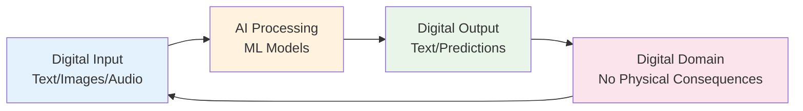
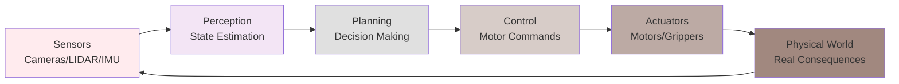
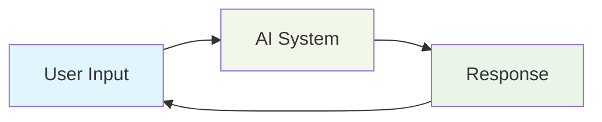
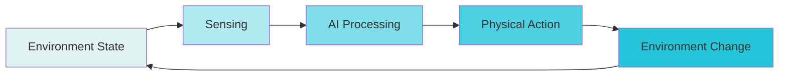
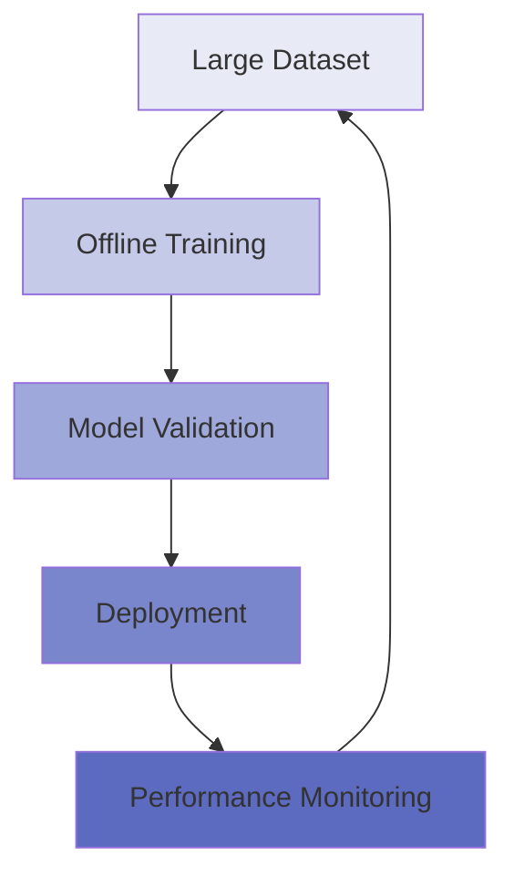
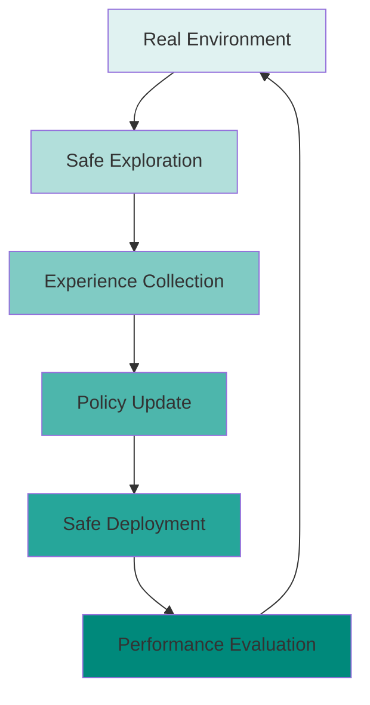
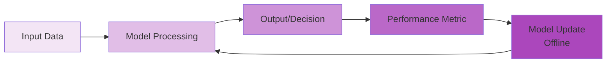
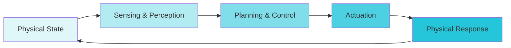

# Digital AI vs Physical AI Comparison Diagrams

## Architecture Comparison

### Digital AI Architecture


### Physical AI Architecture


## Interaction Model Comparison

### Digital AI Interaction


### Physical AI Interaction


## Temporal Constraints Comparison

### Digital AI Timing

```mermaid
gantt
    title Digital AI Processing Timeline
    dateFormat  X
    axisFormat %L sec

    User Request     :0, 5
    Processing       :1, 4
    Response Ready   :4, 5
```


### Physical AI Timing

```mermaid
gantt
    title Physical AI Control Timeline
    dateFormat  X
    axisFormat %L ms

    Sense Environment    :0, 8
    Process & Plan       :8, 18
    Execute Action       :18, 20
    Next Cycle           :20, 25
```


## Learning Paradigms Comparison

### Digital AI Learning


### Physical AI Learning


## Feedback and Adaptation

### Digital AI Feedback Loop


### Physical AI Feedback Loop


## Risk and Safety Comparison

### Digital AI Risk Profile
- Informational consequences only
- Limited real-world impact
- Can be rolled back easily
- Privacy and bias concerns

### Physical AI Risk Profile
- Physical safety concerns
- Property damage risks
- Cannot always be rolled back
- Real-time safety requirements
```