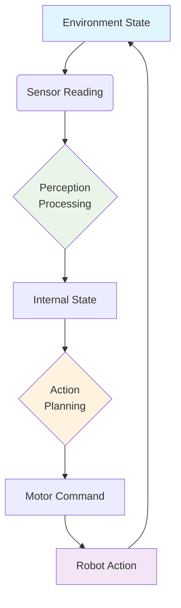
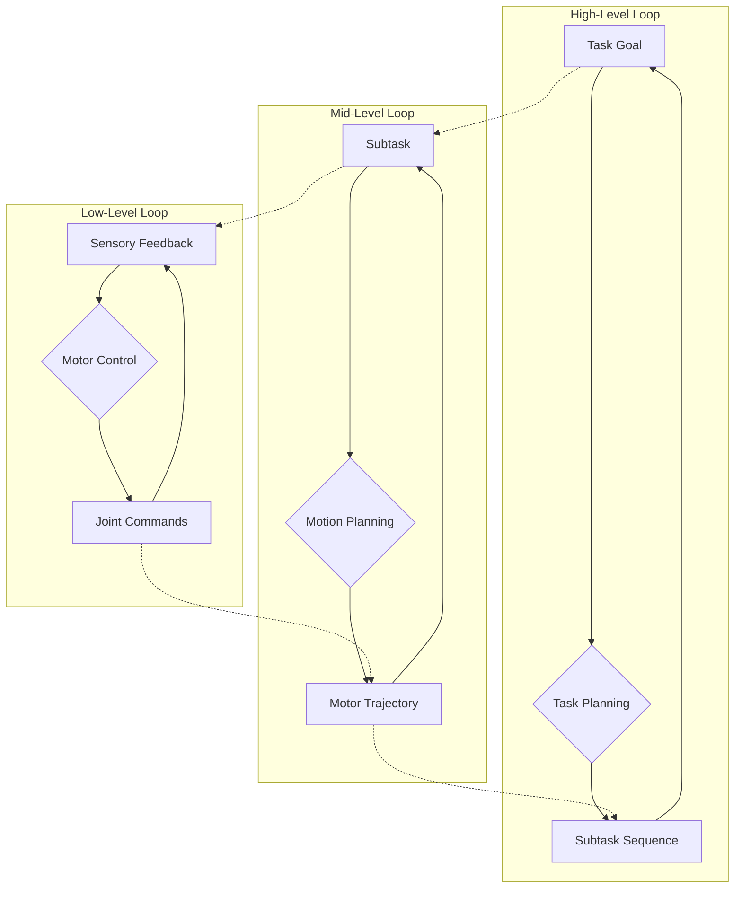
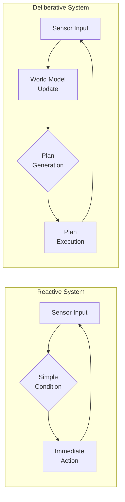
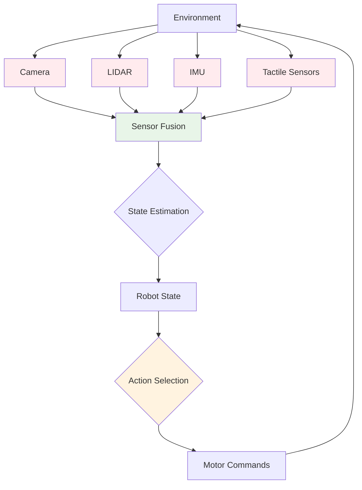
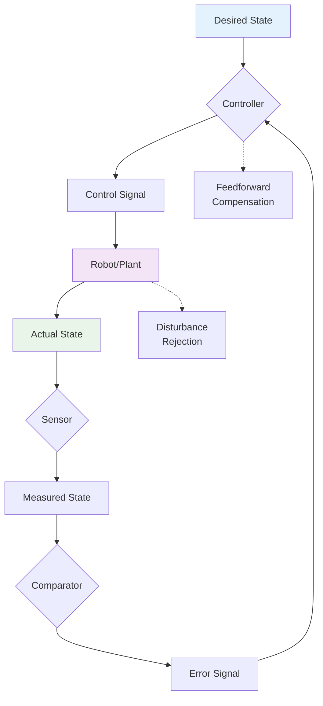

# Perception-Action Loop Diagrams

## Basic Perception-Action Loop

## Hierarchical Perception-Action Loop

## Reactive vs Deliberative Systems

## Sensor Fusion in Perception-Action Loop

## Feedback Mechanisms

